# Ngalo

<h4>SPLASH SCREEN</h4>
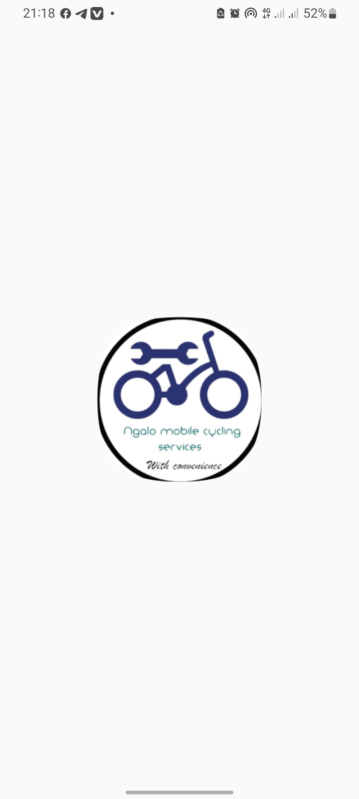
<h4>HOME SCREEN</h4>
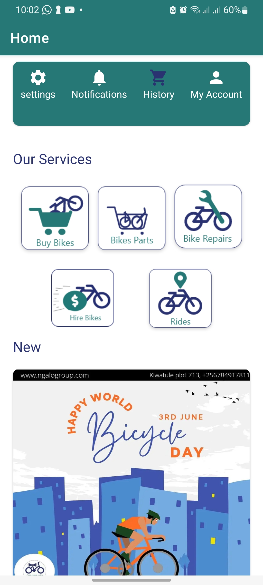
<h4>SETTINGS</h4>
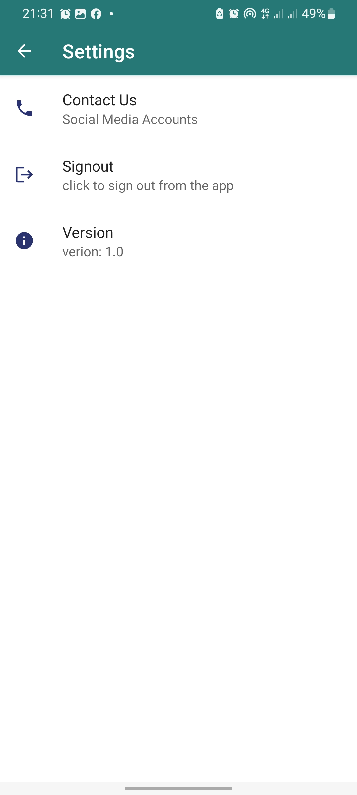
<h4>SOCIAL MEDIA</h4>
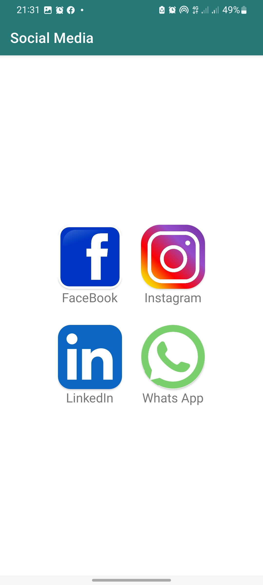
<h4>USER' ORDERS</h4>

<h4>PROFILE</h4>
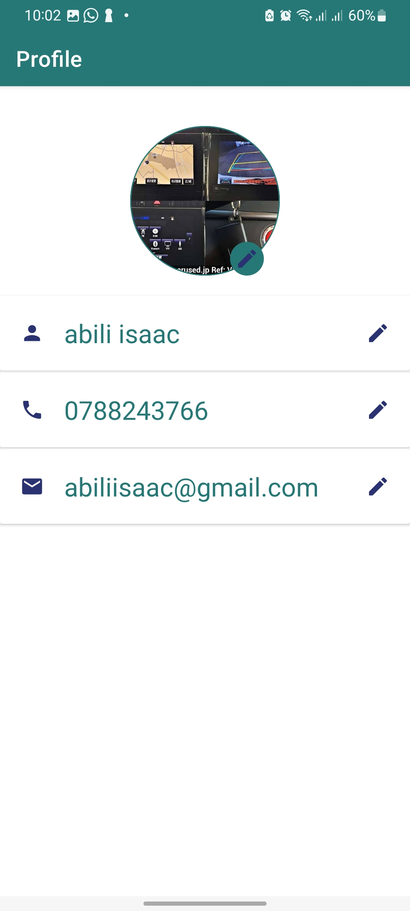
<h4>BUY BIKES</h4>
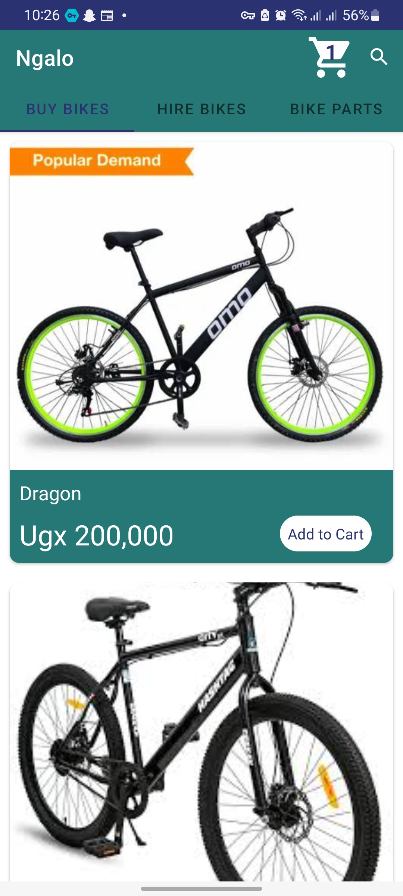
<h4>CART</h4>
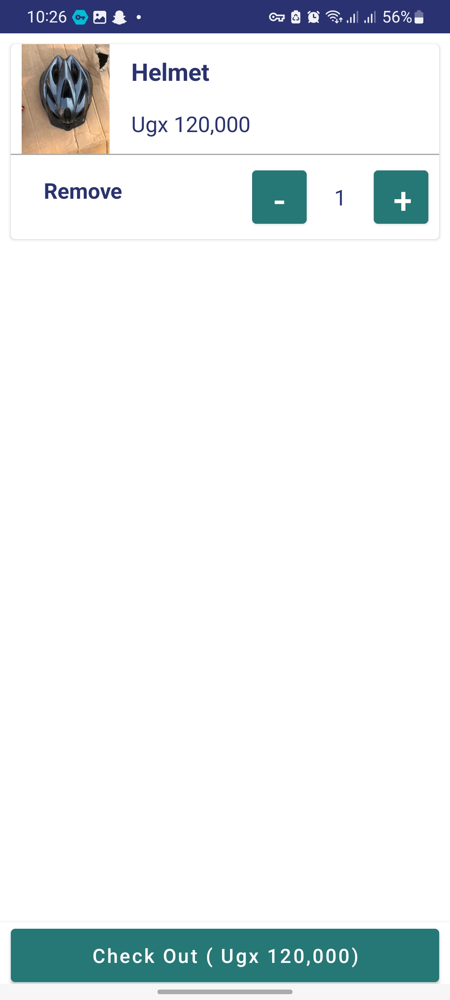
<h4>CHECK OUT]</h4>
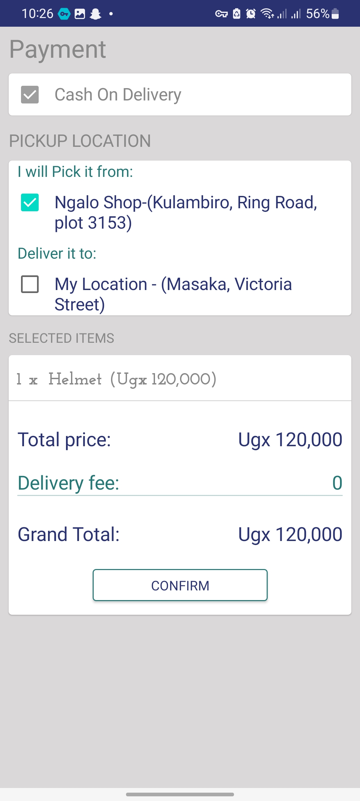
<h4>CONFIRM ORDER</h4>
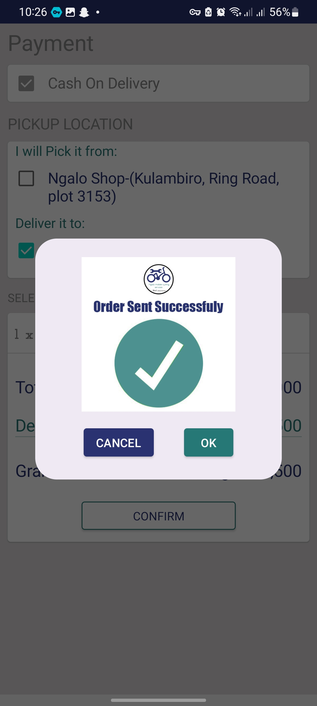
<h4>BIKE PARTS</h4>
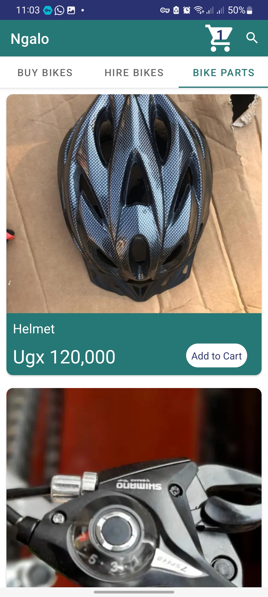
<h4>HIRE BIKES</h4>
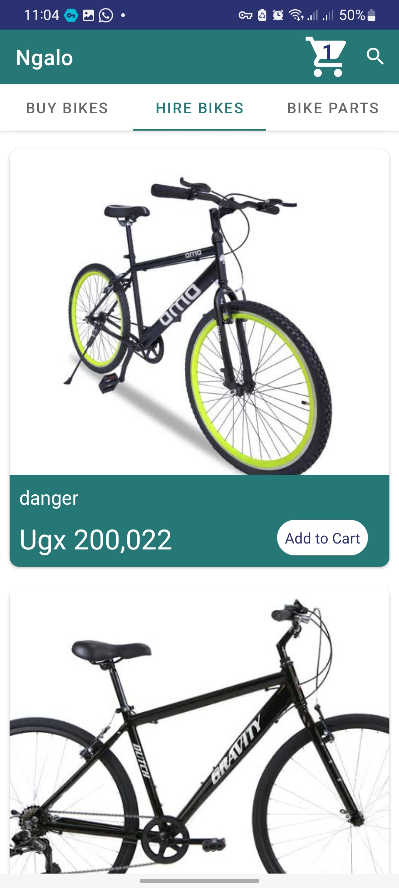
<h4>AUTH SCREEN</h4>
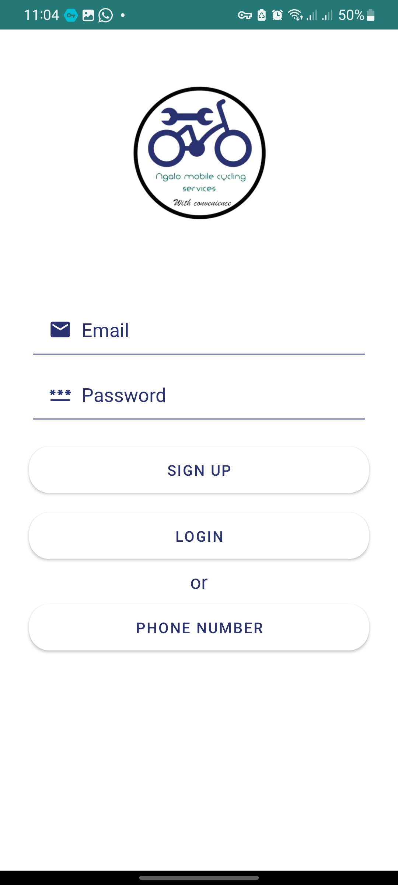
<h4>START RIDE</h4>
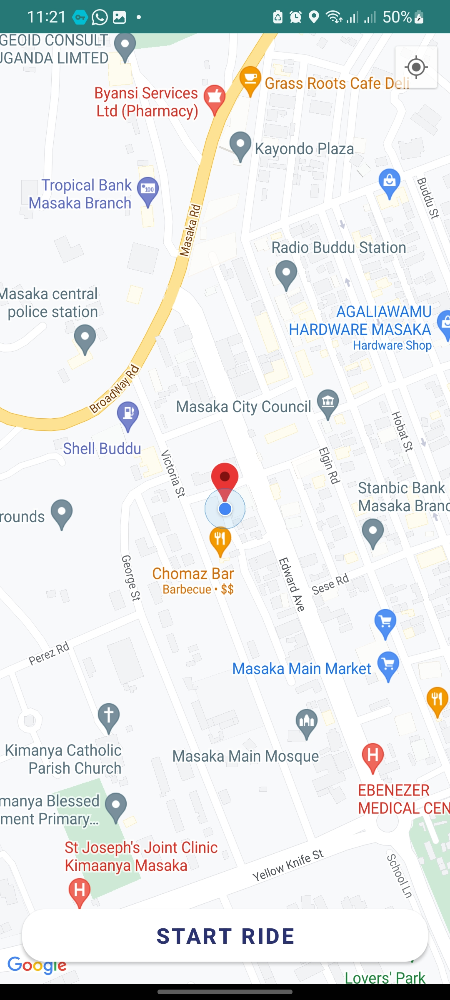
<h4>TRACK RIDE</h4>
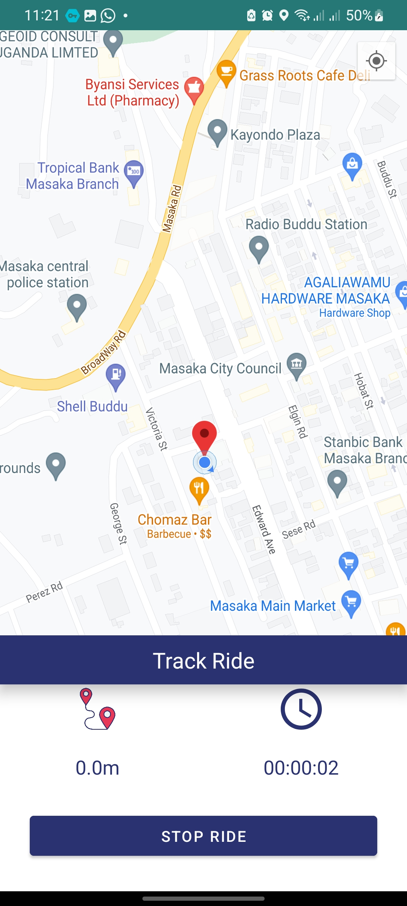
<h4>RIDE SUMMARY</h4>
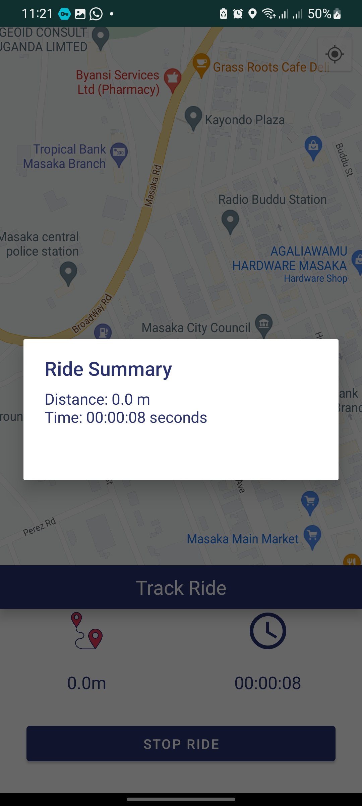
<h4>REQUEST BIKE REPAIR</h4>
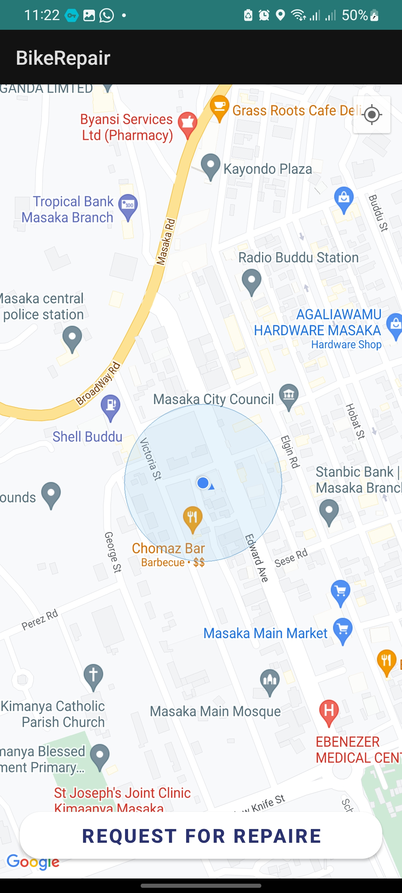
<h4>REQUEST BIKE REPAIR</h4>
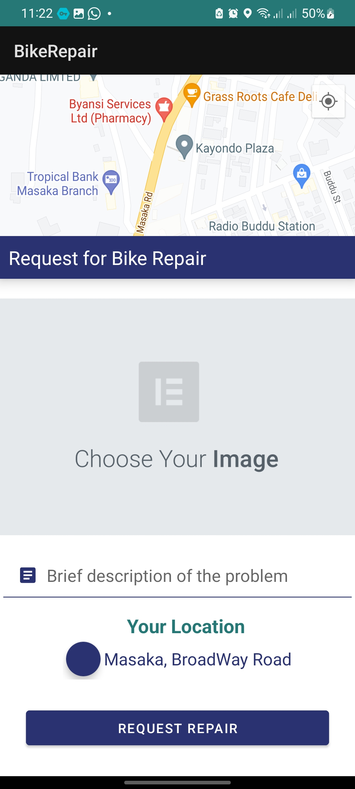

